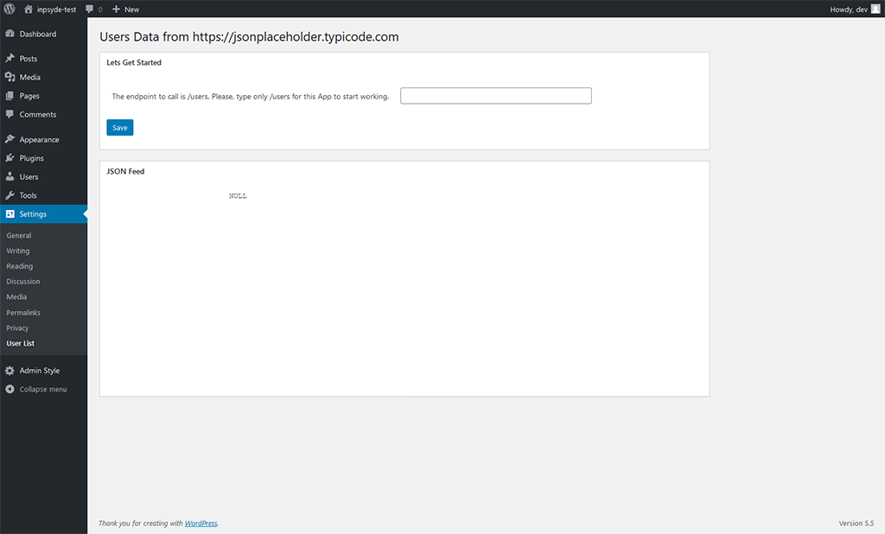
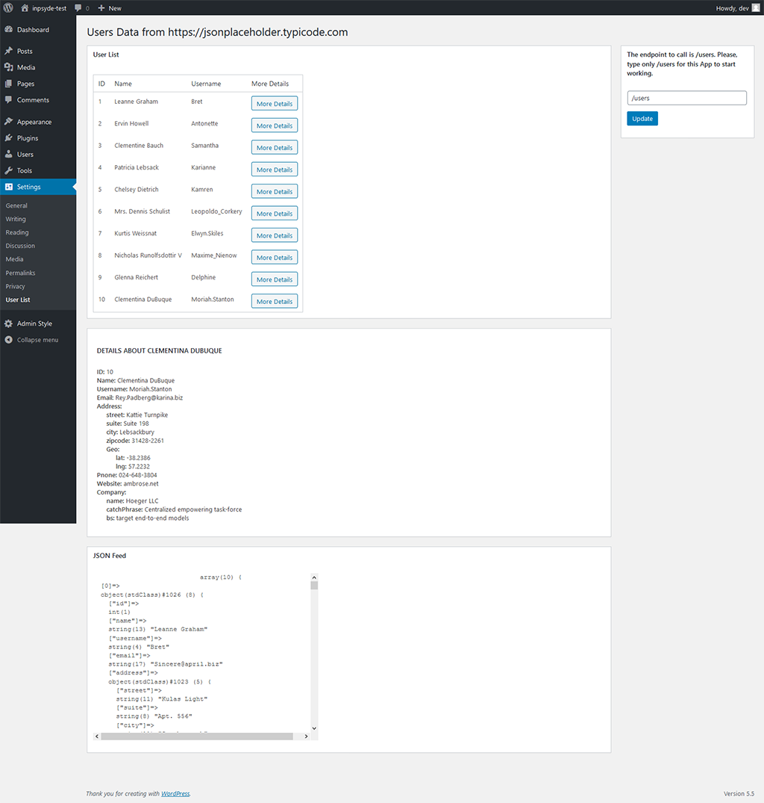

# IK-USERS 
## Wordpress plugin
### gets a data about users from
#### https://jsonplaceholder.typicode.com/ 

== Installation ==
 
1. Upload folder `ik-users` from github.com to the `/wp-content/plugins/` directory via git or via composer.
1. Activate the plugin through the 'Plugins' menu in WordPress
1. Go to `Settings` -> `User List` page

1. Please, type the endpoint /users and click the button `Save`. 

 
== Description ==
* Author: [Ihor Khaletskyi](http://wp.medi-com.info)
* Project URI on github.com: <https://github.com/ik-code/ik-users>

The plugin  sends an HTTP request to a REST API endpoint. 
The API is available at https://jsonplaceholder.typicode.com/ and the endpoint to call is /users.

The plugin  parses the JSON response and uses it to build and display an HTML table on dashboard Wordpress ik-users page.

Each row in the HTML table will show the details for a user. There are column's: id, name, username, more details links.

When a visitor clicks any of these links, the details of that user will be shown. 
For that, the plugin will do API request to the user-details endpoint.

These details fetching requests are asynchronous (AJAX) and the user details will be shown without reloading the page.
At any time, the page will show details for at max one user. 
In fact, at every link click, a new user detail will load, replacing the one currently shown.

== Frequently Asked Questions ==
 
= How to download plugin via composer =

1. Create a composer.json file in folder with your Wordpress project with the same structure:
`{
   "name": "vendor_name/package_name",
   "description": "description_text",
   "minimum-stability": "stable",
   "license": "proprietary",
   "authors": [
     {
       "name": "author's name",
       "email": "email@example.com"
     }
   ],
   "repositories": [{
     "type": "vcs",
     "url": "git@github.com:ik-code/ik-users.git"
   }
   ]
 }`
 1. Launch from the command line `composer require ik-code/ik-users`
 1. In the folder `wp-content/plugins` will be installed plugin `ik-users`
 1. Activate it through Wordpress Dashboard 

== Changelog ==

= Version 1.0.0=

== Upgrade Notice ==
 
= 1.0.0 =
This is first version of plugin

== License ==
 
IK-USERS plugin is copyright © 2020 with
[GNU General Public License](http://www.gnu.org/copyleft/gpl.html) by Ihor Khaletskyi. 
 
This program is free software; you can redistribute it
and/or modify it under the terms of the
[GNU General Public License](http://www.gnu.org/copyleft/gpl.html) as published by the Free
Software Foundation; either version 2 of the License, or
(at your option) any later version.
 
This program is distributed in the hope that it will be
useful, but WITHOUT ANY WARRANTY; without even the implied
warranty of MERCHANTABILITY or FITNESS FOR A PARTICULAR
PURPOSE. See the GNU General Public License for more details.
 [GNU General Public License](http://www.gnu.org/copyleft/gpl.html)
   
   
== ToDo ==

The next version or later:
 
1. first Ability.
1. second Ability.
